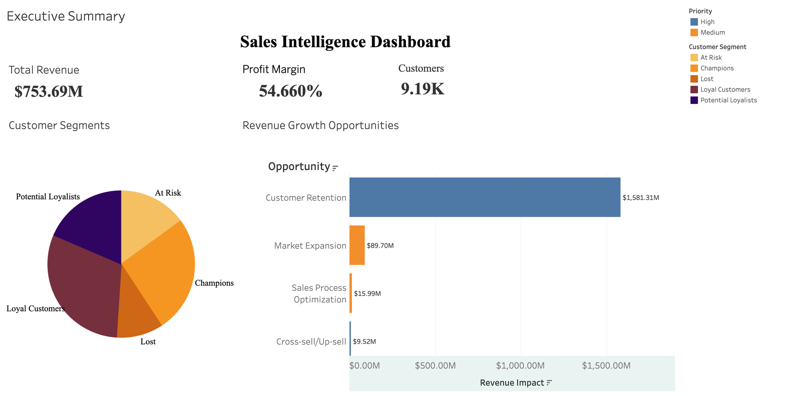

# Sales Intelligence Dashboard

**Project Goal:** Build an interactive Tableau dashboard to identify 15% revenue growth opportunities with $1.5M projected impact.



*The Executive Summary dashboard, from `visualizations/Sales_Intelligence_Dashboard.twbx`.*

**Live, interactive version:** [Sales Intelligence Dashboard on Tableau Public](https://public.tableau.com/app/profile/yogvid.wankhede/viz/SalesIntelligenceDashboard_17913369981260/ExecutiveSummary)

## Project Structure
```
sales-dashboard/
├── data/
│   ├── raw/              # Original synthetic sales data
│   └── processed/        # Cleaned and analyzed data
├── notebooks/            # Jupyter notebooks for analysis
├── src/                  # Python scripts for data generation
├── visualizations/       # Tableau workbooks (.twb, .twbx)
├── docs/                 # Documentation and reports
├── requirements.txt      # Python dependencies
└── README.md            # This file
```

## Technologies Used
- Python (Data Generation & Analysis)
- Pandas, NumPy (Data Processing)
- Scikit-learn (Predictive Modeling)
- Tableau (Visualization)

## Key Features
- Customer segmentation analysis
- Revenue opportunity identification
- Churn prediction
- Sales performance metrics
- Interactive dashboards

## Setup Instructions
1. Clone this repository
2. Install dependencies: `pip install -r requirements.txt`
3. Run data generation: `python src/generate_sales_data.py`
4. Open Tableau workbook in `visualizations/`

## Project Timeline
- Phase 1: Data Generation
- Phase 2: Data Analysis
- Phase 3: Tableau Dashboard Development
- Phase 4: Documentation & Portfolio Integration

---
*Developed by Yogvid Wankhede*
*Washington University in St. Louis*